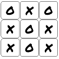
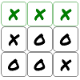
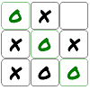
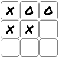

# First Shape (Javascript)
This is a fairly simple project that includes two common games with AI's powered entirely by neural networks. Only basic html and javascript knowledge is required to understand the code.

This code is currently hosted using GitHub Pages, so try it out [here](https://geo-desic.github.io/first-shape-js).

## Installation
Create a site using any web server and make the contents of this repository available to it. Make sure the default page is set to index.html.

## Background and Motivation
This project was created as part of a larger initiative to:

- Learn some game theory
- Learn how strong AI's are designed
- Learn how to design an AI that it is easy to understand and use
- Try to gain some insight into what makes a particular game fun and fair

The name First Shape was chosen as a general term to represent any board game where:

- Each player has a single piece type
- Pieces cannot be moved/removed once played
- The objective is to be the first player to form one of the "winning" shapes on the board with their pieces

#### Examples:
- [Tic Tac Toe](https://en.wikipedia.org/wiki/Tic-tac-toe)
- 4x4 Tic Tac Toe With Squares
- [Connect 4](https://en.wikipedia.org/wiki/Connect_Four)
- [Gomoku](https://en.wikipedia.org/wiki/Gomoku)

The winning shapes for the games above are mostly horizontal, vertical, or diagonal lines of a specific length. However, notice squares are included in the second one. In general, any set of shapes could be used but likely need to be chosen carefully in conjunction with the board in order for the game to be deemed "fair" and "fun". For example, try playing Tic Tac Toe on a 3x4 board with the same winning shapes used in a 3x3 board (i.e. horizontal, vertical, and diagonal lines of length 3). It will become obvious fairly quickly that the game is unfair because the first player can always win. Or try playing Tic Tac Toe on a 6x6 board with lines of length 6. It will become boring quickly as it is too easy to force a draw.

## Pertinent Files
- [index.html](index.html) contains the html code
- [first_shape.js](first_shape.js) contains a minimal implementation of the first shape game
- [script.js](script.js) contains the code to load the neural network models and interact with the html
- [ttt_model](ttt_model) and [ttt_4_model](ttt_4_model) are directories containing the neural network models
- [ttt_zip](https://github.com/geo-desic/public-data/blob/master/first-shape/ttt.zip) and [ttt_4_sq.zip](https://github.com/geo-desic/public-data/blob/master/first-shape/ttt_4_sq.zip) contain the data used to train the neural networks

## AI Information
A separate project was used to create the data used to train the neural networks. That project used a [Negamax](https://en.wikipedia.org/wiki/Negamax) search to assign a "score" to unique board states. The score is used to determine whether the board state represents a win, loss, or draw assuming perfect play from all players. One common practice is to assign score values from the first player's perspective using the integers: 1 (win), 0 (draw), and -1 (loss). This is similar to the approach used, but modified slightly to allow the score to contain a bit more information and make it easy to design an AI that would not only try to win, but also try to win in as few moves as possible.

### Board Representation and Score
Board states are represented as an array of integers: 0, 1, or 2. The length is the number of locations on the board (e.g. 9 for 3x3 Tic Tac Toe) and the value is the player # associated with the board location, or zero if the location is empty.

Score | Definition
----- | ----------
0 | draw
+N | win for player 1
-N | win for player 2

where N > 0 and N - 1 is the number of empty locations on the board

#### Examples:

---------------------------
__Draw__

Score = 0

Board = [2, 1, 2, 1, 2, 1, 1, 2, 1]

---------------------------
__Win: Player 1__

Score = 1

Board = [1, 1, 1, 1, 2, 2, 2, 2, 1]

---------------------------
__Win: Player 2__

Score = -2

Board = [2, 1, 0, 1, 2, 1, 1, 2, 2]

---------------------------
__Forced Win: Player 1__

Score = 3

Board = [1, 2, 0, 1, 1, 2, 0, 0, 0]

---------------------------

The two games currently included in this project are small enough that the exact score could be determined for every unique board position. However, note that for boards even slightly larger then these this would not be feasible and a heuristic approach would likely be required. This is because the number of unique board states increases significantly with the board size. The counts below do not take into account any type of board symmetry.

Game | Unique Board States
---- | -------------------
3x3 Tic Tac Toe | 5478
4x4 Tic Tac Toe With Squares | 9364904

### Neural Networks
Once the necessary data was generated, the models were trained using the board representation defined above as input and the score as output. [TensorFlow](https://www.tensorflow.org) was the machine learning platform used which makes it extremely easy to save models for use in javascript. While the model design and training code isn't included here, it was not very complicated. Both contained 2 to 3 two dimensional convolutional layers followed by 2 to 3 dense layers. These may not be optimal, but worked well enough to achieve the desired goal of strong play.

#### AI Strength
The AI for 3x3 Tic Tac Toe is believed to be perfect (#). The AI for 4x4 Tic Tac Toe With Squares is strong but not perfect. Given the large size of the dataset, the model training process took a while on the older hardware used. A future goal is to tweak the model a bit and retrain on upgraded hardware hopefully making it perfect as well.

(#) This relies upon the assumption that the datasets, [ttt_zip](https://github.com/geo-desic/public-data/blob/master/first-shape/ttt.zip) and [ttt_4_sq.zip](https://github.com/geo-desic/public-data/blob/master/first-shape/ttt_4_sq.zip), used to train the models were both entirely accurate and comprehensive (i.e. include all unique board states). This is believed to be true, however it should not be difficult to independently verify.

Statistics were gathered during the model training process shown below. The most important of these is maximum absolute error. This is the largest absolute difference between an actual and predicted score spanning the entire dataset. Therefore all predictions are contained in an interval of the form [N - e, N + e] where e is the maximum absolute error and N is an integer (all actual scores are integers). As long as e is small enough, less than 0.5, all of these intervals are disjoint and the actual score can be determined from the prediction simply by rounding to the nearest integer. This makes the model a perfect predictor and the AI will play perfectly. The maximum absolute error for the 3x3 Tic Tac Toe model is well below this threshold.

Model | Maximum Absolute Error | [MAE](https://en.wikipedia.org/wiki/Mean_absolute_error) | [MSE](https://en.wikipedia.org/wiki/Mean_squared_error)
----- | ---------------------- | ------------------- | ------------------
ttt_model | 0.0897 | 0.0014 | 0.00001

## Why is this interesting?
- The AI code is extremely simple: use the trained model to predict the score after all valid moves and choose a move that results in the highest score (player 1) or lowest score (player 2)
  - Note that a "best move" is not necessarily unique. There may be multple moves that result in board states with the same actual score. So, the code included in this project identifies all moves that result in the highest/lowest score and randomly picks one of those. This allows for randomization in AI without hindering its strength.
- These games are run entirely in the browser (no server side code execution or integration)
- While common brute force approaches to game AI such as the [minimax](https://en.wikipedia.org/wiki/Minimax) algorithm are extremely resource (CPU) intensive during game play and require highly optimized code, this approach does not
  - One way to think about it is most of that complex analysis was performed prior to game play and "trained" into the models
- A model can accurately make predictions while it's size may be significantly smaller than the actual data used to train it
  - Example: ttt_4_sq.csv is 412MB but ttt_4_model is approximately 8MB (and it's highly likely this could be reduced further)

